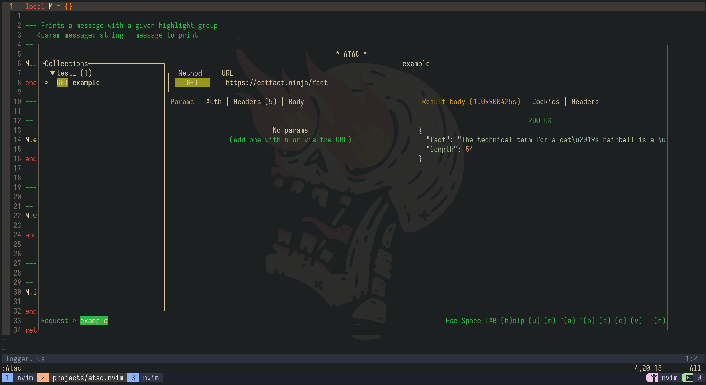

<div align="center">

# atac.nvim

## ⚔📩 An `atac` port for neovim 🔌

</div>

<div align="center">


</div>

<div align="center">


</div>

</div>

## Overview

`atac.nvim` is a [`atac` plugin](https://github.com/Julien-cpsn/ATAC) for neovim that allows you to make REST requests without leaving neovim.

## ✨ Features

- ✨ Toggle `Atac` in neovim without leaving your workspace. Just use `Atac` command.



## 🔌 Available commands

- `Atac`

## ⚡️Requirements

- `neovim` >= 0.9 and nightly 0.10-dev releases
- `atac` >= 0.13.0


## 💻 Installation

Make sure you have [atac](https://github.com/Julien-cpsn/ATAC) installed.<br>Have in mind there are some caveats in installing ATAC in MacOS, be advised.

Install the `atac.nvim` neovim plugin with your favorite package manager:

[Lazy](https://github.com/folke/lazy.nvim)

```lua
  {
    "NachoNievaG/atac.nvim",
    dependencies = { "akinsho/toggleterm.nvim" },
    config = function() require("atac").setup {} end,
    event = "BufRead", -- or any other event you might want to use.
  },
```

[Packer](https://github.com/wbthomason/packer.nvim)
```lua
  use {
    "NachoNievaG/atac.nvim",
    requires = { "akinsho/toggleterm.nvim" },
    config = function() require('atac').setup() end
  }
```
